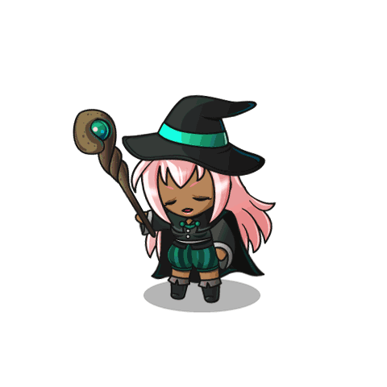
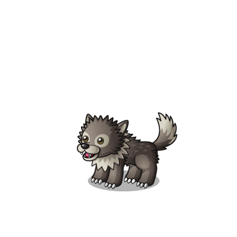
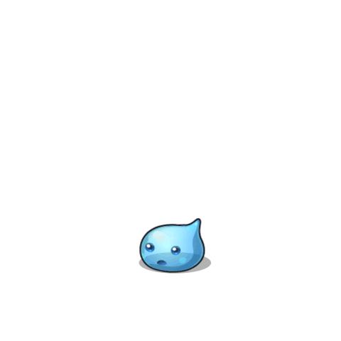
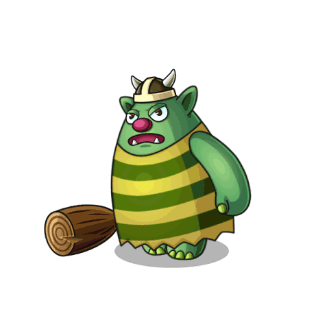

<p align="center">
  
  
  
  
</p>

<h1 align="center">#ImersaoGameDev<br>
  
<p align="center">
  

  

  <a href="https://github.com/vinniciusgomes/acharep/commits/master">
    
  </a>

  <a href="https://github.com/vinniciusgomes/acharep/issues">
    
  </a>

  
</p>

## 🔖 Descrição

Criação de um jogo utilizando Javascript na semana da #ImersãoGameDev da Alura.

A Imersão Game Dev tem como objetivo criar um jogo 2D utilizando JavaScript. Foi utilizado a biblioteca P5.js, está biblioteca possui uma quantidade de funcionalidades relacionadas a renderização de imagens e objetos no navegador. A ideia da imersão é criar um jogo do 0 utilizando o mínimo possível de bibliotecas, e sem a utilização de Engines.

📦 O download completo de todas as sprites, podem ser encontradas em: [
PIPOYA FREE 2D Game Character Sprites](https://pipoya.itch.io/pipoya-free-2d-game-character-sprites)

## 🚀 Tecnologias

- HTML5
- JavaScript
- Canvas
- P5.js

## 🕹️ Como rodar

```bash
# Clone esse repositório
$ git clone https://github.com/vinniciusgomes/witch-game.git

# Abra o arquivo
index.html
```

## 🤔 Como contribuir

- Faça um fork desse repositório;
- Cria uma branch com a sua feature: `git checkout -b minha-feature`;
- Faça commit das suas alterações: `git commit -m 'feat: Minha nova feature'`;
- Faça push para a sua branch: `git push origin minha-feature`.

## 🖼 Previa do Jogo


## :memo: Licença

Esse projeto está sob a licença MIT. Veja o arquivo [LICENSE](LICENSE.md) para mais detalhes.

---

##### Feito com ♥ by Vinnicius Gomes
